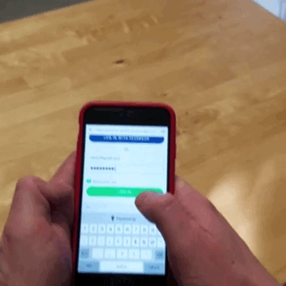
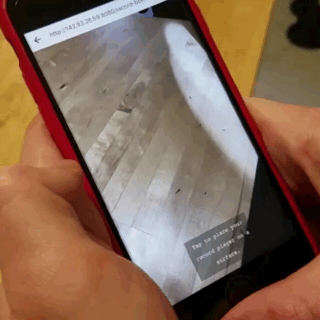
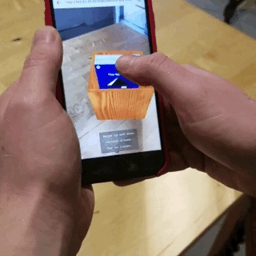

# ar-record-box

The AR Record Box is a fun experiment to use Google's WebARonARKit in conjunction with three.js and the Spotify API. A user can login to their Spotify account, place their record box on a surface, swipe through 20 albums from their Spotify library, and select an album to listen to. 

If you would like to see this working on your phone, you will need to have an <a href="https://developer.apple.com/">Apple Developer's account</a>, and follow the instructions to get <a href="https://github.com/google-ar/WebARonARKit">WebARonArKit</a> working on your device. Afterwards, you can either clone the repo and start a local server to visit through the webview in the WebARonARKit app, or <a href="http://142.93.26.59:8080/">visit</a> where I currently have this hosted. 

The app currently only plays 30-second previews of songs on Spotify, even if logged in. This appears to be an issue with the player from the Spotify API that I will try to refine. 
